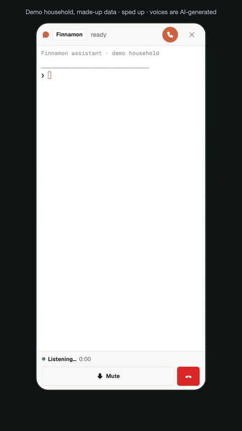
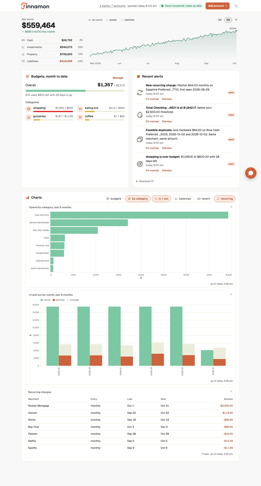
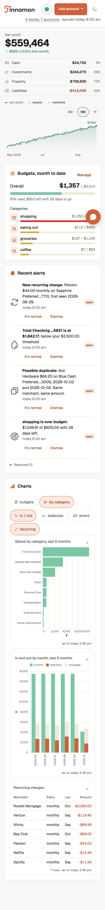

# Finnamon

[](https://github.com/bill10/finnamon/actions/workflows/test.yml)

## Your money. Your financial AI.

**Turn Claude or Codex into your personal finance assistant.**

Like Mint, but it warns you when something's off, sorts your transactions with AI, and draws any chart you ask for.
On your own computer (Mac, Linux or Windows via WSL2), with no ads and no data selling, so nobody can shut it down.

<p align="center"><a href="https://github.com/bill10/finnamon/releases/download/pr-assets/finnamon-demo.mp4"></a><br>
<sub><a href="https://github.com/bill10/finnamon/releases/download/pr-assets/finnamon-demo.mp4">Watch the 1-minute demo (with sound)</a>. Demo household, made-up data · sped up · voices are AI-generated.</sub></p>

1. **It watches for you.** It messages you only when something needs you: a duplicate charge, a new subscription,
   a budget about to go over.
2. **A dashboard that's yours.** Ask "dining by month" or "everything over $500" and your assistant draws it, whenever you want.
3. **Yours to keep.** Your data lives on your machine, with your own keys.

**Bank not on Plaid, or rather not hand Plaid your login?** Fetch by AI: you log in to your bank's own site yourself,
then Claude clicks through to the CSV export and imports it. It never types or sees your password. Tested on HSBC US,
which Plaid doesn't support, through the Claude in Chrome extension. Claude Code only for now.

## Why I built this

I loved Mint: one clean place for all my accounts and transactions, no ads. Then it was shut down, and nothing else
fit, so I built my own. Mint rarely told me when something was wrong, so I added alerts. And Mint came before AI, so
I recategorized a lot by hand. Now the AI does it, and I can just ask how we're doing.

<p>
  
  
</p>

<sub>The demo household from `finnamon demo`. Every number is made up.</sub>

### What lands in your Telegram

> ⚠️ **Possible duplicate:** Shell $52.18 on Chase Checking …4821, charged Sep 17 and again Sep 18. Same merchant,
> same amount. Reply "it's normal" if you filled up twice.

> 🔁 **New subscription:** Peloton $44.00 monthly on Sapphire …7710, first seen Aug 29. Expected? Reply "it's normal"
> and I won't ask again.

> 📊 **Dining is on pace to go over:** $248 spent by day 20, tracking to $372 against your $350 budget.

(Examples, not real alerts.) Reply in plain words: "it's normal", "set dining 400", "how much did we spend on the dog
this year". Most days it says nothing; on Sunday you get a short roundup.

## Try it in 2 minutes: `finnamon demo` (no keys)

<!-- set when the public repo exists: replace <repo> with its clone URL (#113) -->
```
git clone <repo> ~/finnamon && cd ~/finnamon
uv tool install -e . && uv tool update-shell   # then open a new terminal
(cd web && npm install)                        # Node 20.12+
finnamon demo                                  # a made-up household and its dashboard on a spare port
finnamon demo --stop                           # --reset starts the household over
```

Four banks, six months of transactions, budgets, recurring charges and alerts, and the intercom (your Claude Code
over the demo data). Nothing touches Plaid, Telegram or a real household.

## Who it's for

- A **technical household**: you're comfortable in a terminal and with a config step or two.
- **A computer that stays on: Mac, Linux, or Windows via WSL2** (a Mac mini, or a laptop that mostly sleeps at home). Linux needs systemd; on Windows, Finnamon runs in Ubuntu under WSL2 ([how](docs/INSTALL.md#windows-wsl2)).
- **A Claude subscription (Pro/Max) or a ChatGPT Plus plan (or higher), or an OpenAI API key.** The assistant is Claude Code
  (`claude`) or OpenAI's Codex CLI (`codex`, 0.157 or newer): triage, chat and the dashboard's intercom all run the one you
  pick (`finnamon init` asks; `finnamon settings set assistant codex|claude` switches). A few features are Claude-only for
  now: [what Codex doesn't do yet](docs/INSTALL.md#codex-what-v1-does-not-do).
- **Banks in the US or Canada**, for Plaid's free Trial plan. For a bank Plaid can't reach, **Fetch by AI** (Claude Code
  2.1.292+ and Google Chrome) opens the bank for you to log in, then downloads and imports its CSV export, or you import the CSV yourself
  ([how](docs/COMMANDS.md)). These imports happen when you run them; only Plaid banks sync on their own.

## What it costs

| | Cost |
|---|---|
| Finnamon | Free |
| Claude or Codex | Free + your Claude or ChatGPT subscription: Claude Pro or Max (or Console credit), or ChatGPT Plus or higher (or OpenAI API credit). **One of them is required.** Codex uses your existing Codex login, shared with your own `codex`. |
| Plaid | Free on the Trial plan: 10 bank logins with real data, for US/Canada teams created on or after 2026-04-15. Per Plaid it includes the big OAuth banks (Chase, Bank of America, Wells Fargo). Older teams get Limited Production, without those banks. |
| Telegram, Tailscale | Free |

## What leaves your machine

Your data lives in one SQLite file on your own computer. Some of it still travels, and here is where:

- **Plaid**: your transactions and balances come *from* your banks *through* Plaid, on your own Plaid keys.
- **Anthropic, through Claude**: when the assistant triages an alert or answers a question, the merchant names, amounts
  and dates it reads go to Anthropic, under your Claude account's terms. **Turn off "Help improve Claude"** in
  Claude's privacy settings: with it on, Anthropic keeps that data for 5 years, with it off for 30 days.
- **OpenAI, through Codex**, only when Codex is the assistant (`finnamon settings set assistant codex`): the same data goes
  to OpenAI instead of Anthropic, under your ChatGPT or OpenAI account's terms. On a ChatGPT plan, **turn off "Improve the
  model for everyone"** (ChatGPT → Settings → Data controls): with it on, OpenAI may use what Codex sends to train its
  models. With an OpenAI API key, API data is not used for training by default. Nothing goes to Anthropic then.
- **Anthropic, through Fetch by AI**: when Claude fetches a bank's export, what it reads on the bank's pages after you
  log in (account names, balances, transactions, as screenshots and page text) goes to Anthropic the same way. It makes
  no browser call while you log in, so your password is never on its screen.
- **Telegram**: alerts and your chat with the bot pass through Telegram's servers. Bot chats are not end-to-end
  encrypted.
- **Nothing goes to a Finnamon company or server.** There isn't one. No telemetry, no account.
- **Stays local**: your bank credentials (you log in at Plaid or the bank yourself, never in Finnamon or to the AI), full account numbers,
  your Plaid keys and bot token (`~/.finnamon/secrets.toml`, mode 0600).

## How it compares

As of 2026-10-03; sources are listed in the [market research](docs/market-research-2026-10.md).

| | Finnamon | ChatGPT Finances | Monarch | Actual Budget | Firefly III |
|---|---|---|---|---|---|
| Where data lives | Your computer (SQLite) | OpenAI's cloud | Monarch's cloud | Self-hosted | Self-hosted |
| Bank sync | Plaid (your keys); for banks Plaid can't reach, Fetch by AI or CSV import | Plaid | Built in (aggregators) | SimpleFIN (US), GoCardless (EU) | Separate importer |
| Cost | Free + your Claude or ChatGPT subscription | $0 in the US since 2026-10-02 | $99.99/yr | Free | Free |
| Proactive alerts | Yes: rules plus AI triage (Claude or Codex), only what needs a human | Credit score only | Rule-based push alerts, weekly recap | No | Rules, bill reminders |
| AI Q&A and charts | Yes (your Claude or Codex) | Yes | Yes | No | No |
| Household | Yes: one chat, shared budgets | Single user | Yes | — | — |
| Open source | Yes (MIT) | No | No | Yes (MIT) | Yes (AGPL) |

## Install

Plaid approval is the slow part, so start there. The full guide, with what each step asks for, is
**[docs/INSTALL.md](docs/INSTALL.md)**. The short version:

<!-- set when the public repo exists: replace <repo> with its clone URL (#113) -->
```
brew install uv node                           # Python 3.11+ via uv, Node 20.12+ for the dashboard
git clone <repo> ~/finnamon && cd ~/finnamon
uv tool install -e .                           # puts `finnamon` on PATH
uv tool update-shell                           # if `finnamon` is "not found"; then open a new terminal
finnamon init                                  # Plaid keys → Telegram bot → assistant (Claude Code, or Codex) → dashboard → always-on jobs
finnamon open                                  # link a bank, then ask the intercom to "set up my budgets"
finnamon doctor                                # checks every piece and prints the fix for each problem
```

Every `init` step can be skipped and added later by running `finnamon init` again. Later releases: `finnamon update`.

---

## How it works

Claude Code (or Codex) is the agent; Finnamon is the infrastructure an agent needs: a data layer, an always-on daemon, a CLI,
SQL detectors and delivery. Design: [docs/designs/finance-watchdog-agent.md](docs/designs/finance-watchdog-agent.md).

```
finnamon daemon (always on)                      claude (on demand, in ~/.finnamon/assistant)
  sync every 6h → detect → triage → notify        interactive: the dashboard's intercom, or cd ~/.finnamon/assistant && claude --strict-mcp-config
  long-poll Telegram → claude -p --resume         headless: invoked by the daemon per message
heartbeat (hourly timer): is the daemon alive?    /triage: invoked by the daemon per run with candidates
```

- **Rules** (`finnamon/detectors/rules/*.sql`): duplicate charge, new recurring charge, subscription price change, low balance, budget pace, sync health. SQL only, zero tokens, one message each.
- **Anomaly candidates** (`detectors/candidates/*.sql`): first-ever merchant, amount outlier, new category, no identifiable source, unmatched transfer, recurring payment missed. SQL finds them; the `/triage` skill decides which a good assistant would mention (immediately, or in Sunday's roundup) and why. It can only promote or suppress what SQL found; the triage run is read-only apart from `finnamon triage set`.
- **Every detector** selects from the shared prelude `detectors/_prelude.sql`, which resolves merchant aliases, category overrides, suppressions, and joint-account mirrors as of the run timestamp, so every alert can be replayed. The same resolution without the as-of scoping is a view, `tx_now` (`migrations/005_tx_now_view.sql`), and that is what `finnamon query`, budgets, charts and the MCP tools read.

The household's assistant runs in `~/.finnamon/assistant/`: its instructions, permission set and skills, written there
from `finnamon/assistant_bundle/` by `init`, `install` and `update`. It writes only through allow-listed `finnamon`
commands. On a Codex household the same runs are `codex exec --json` (and `exec resume`), triage is `$triage`, and the
assistant reaches `finnamon` only through Finnamon's `finnamon` MCP tool, under a sealed `~/.finnamon/codex` home. Secrets live in `~/.finnamon/secrets.toml` (0600); everything else is in `~/.finnamon/finnamon.db`, backed up
weekly to `~/.finnamon/backups/` (restoring one: [docs/INSTALL.md](docs/INSTALL.md) section 7).

More:

- [docs/COMMANDS.md](docs/COMMANDS.md): talking to it, and every command (adding banks and partners, Fetch by AI and CSV import for banks Plaid can't reach, updates).
- [docs/DASHBOARD.md](docs/DASHBOARD.md): the web dashboard, its key, and your phone over Tailscale.
- [docs/CHANNEL-MODE.md](docs/CHANNEL-MODE.md): who answers Telegram: `session` (the default, one conversation with the dashboard), the Claude Code plugin (`channel`) or the legacy `daemon` session.

## Development

```
uv sync --extra dev --extra charts
pytest -m "not eval"         # unit tests, offline, about 45 seconds
pytest -m eval               # runs real Claude and real Codex over a fixture household; spends tokens
FINNAMON_HOME=/tmp/x finnamon ...   # any command against a scratch home
```

Add a detector: one `.sql` file returning `(account_id, kind, key, transaction_id, payload)` from `tx`; see any
existing rule. `finnamon detect --sql <name>` prints the assembled query. More in
[docs/DEVELOPMENT.md](docs/DEVELOPMENT.md) and [CONTRIBUTING.md](CONTRIBUTING.md); security reports:
[SECURITY.md](SECURITY.md).

## License

MIT. See [LICENSE](LICENSE); third-party notices are in [THIRD_PARTY_NOTICES.md](THIRD_PARTY_NOTICES.md).
